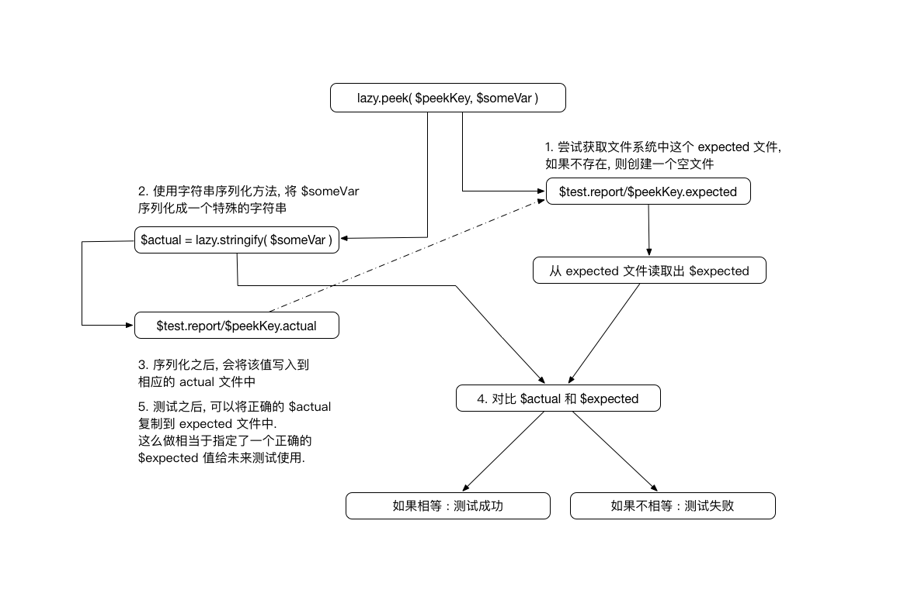

# 什么是 lazy-assert

无论我们多么誓言旦旦要写足够完善的测试, 我们都要直面惨淡的人生, 那就是 "测试并不好写". 这种惨烈的状态在弱类型语言里更甚, 以至于我们常常在面对很多的边际用例时, 要花几分钟思考一下人生, 梳理一下我们的三观, 说很多的话来说服自己, 最后才能鼓起勇气在编辑器里键入 `describe ...`.


## tl;dr

lazy-assert 库的基本思路:

提供一个最基本的 `peek` 方法来检验测试失败或成功.

- 测试里, 随意 `peek( /* 任何你关心的标志变量 */ )`
- `peek` 会将变量序列化成无歧义的字符串
- 然后跟上一次 **正确的** 字符串进行对比, 如果一致, 则测试通过, 否则为测试失败

你可以把 `peek` 简单视为测试过程的带 `assert` 效果, 并具有记忆功能的 `console.log`

整个流程可以用下图解释:



运行环境要求:

- lazy-assert 需要能访问 `fs` node 模块来进行文件读写 (目前的版本被限定在 node 环境下运行)
- lazy-assert 需要使用 `setLocation` 来确定 report 的生成位置, 一般上是使用 `__filename` 来指定与测试文件对应的位置

## 测试为何那么烦人

让我们来反思一下, 写测试本身为什么很痛苦. 下面是几个主要的点:

- 大多数场景下, 我们是按照 "前置预期" 的方式来写测试.
- 遇到复杂的数据结构时, 单单一个测试, 就得写很多的测试判断语句 (或准备复杂的输出预期数据).
- 使用每一个 assert 库前, 都必须对其 api 进行上手熟悉.

### 前置预期

前置预期的最大特点就是: 写测试时, 你必须提前准备好 "环境", "输入" 和 "输出", 并把相应的判断语句写好.

沿用 TDD 的模式, 大多测试都是以 "前置预期" 的思路去写. 比如说有如下的方法:

```
function processSomething(input) { 
    // 做些逻辑判断和操作
    return output
}
``` 

比如, 我们会产出以下的测试:

```
// using chai.should()
processSomething( input ).should.deep.equal( output );
```

看起来很美好吧, 实际上, 在写测试时, 我们会经过以下丰富的内心活动:

```
processSomething(  I<光标所在位置>
```

思考一下... 

```
// using chai.should()
processSomething( input ).should. I<光标所在位置>
```

来, 人肉算一算是什么结果... 

好繁琐啊... 偷偷打印一下结果 `console.log( processSomething(input) )`

看看结果是否正确, 如果正确, 就 copy & paste 作为测试用例的 equal 语句的素材.

Finally...

```
processSomething( input ).should.deep.equal( output );
```

以上的整个流程的时间 = 准备输入素材时间 + 准备输出素材时间 (以及编写输出断言语句)
 
实际场景里, 输入素材的准备相对是比较简单的, 大量的时间会被消耗在准备输出素材以及编写断言语句上面. 这是写测试时间成本高的第一个环节.

### 复杂数据的检验

除了 "前置预期" 的模式外, 面对复杂数据的检验也是一大时间开销.

假设, 有一个 `personList.sort( key )` 的方法. 假设 `personList.list` 是我们关心的结果, 且每一个子项都是一个 `Person` 的对象, 
那么测试很可能长这样: 

```
personList.sort('lastName');

this.personList.list[0].firstName.should.equal('ai');
this.personList.list[1].firstName.should.equal('foo');
this.personList.list[2].firstName.should.equal('bond');
this.personList.list[3].firstName.should.equal('william');
```

当然, 可能会写一些 test utils 来辅助 `assert`, 但是, 这样对应每一种复杂的情况, 开发 utils 方法, 也是一笔额外的开销.
所以, 对这种复杂数据的测试断言 (预期数据) 本身, 也是一个令人头疼的点.

### 断言库的 API 上手

使用任何一个断言库, 都会有一定的 API 上手成本, 这个在熟练之后, 是可以基本忽略不计, 但是仍然是一个初始阶段的开销. 

例如使用 `chai.should()` 你有以下的 API 需要了解 (有些可能不常用) :

```
to, be, been, is, that, which, and, has, have, with, at, of, same, but, does, not, deep, 
nested, own, ordered, any, all, a, include, ok, true, false, null, undefined, NaN, exist, 
empty, arguments, equal, eql, above, least, below, most, within, instanceof, property, 
ownPropertyDescriptor, lengthOf, match, string, keys, throw, respondTo, itself, satisfy, 
closeTo, members, oneOf, change, increase, decrease, by, extensible, sealed, frozen, finite, fail
```

虽然, 这种完整的API提供了异常灵活的支持, 且能够将测试的断言写得非常语义化, 但是它的缺点是:

- 初次上手, 成本高, 得踩踩坑
- 细致地使用API, 会使断言语句的编写和维护 (脑补一下你的代码有一些调整) 成本上升

## lazy-assert 的逻辑


